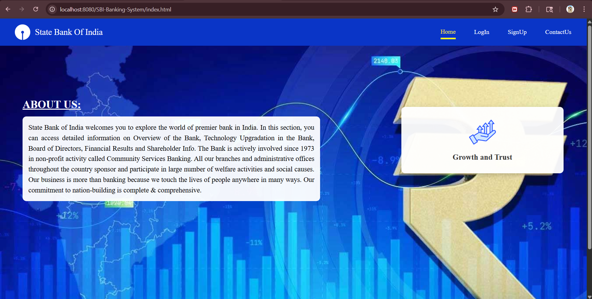
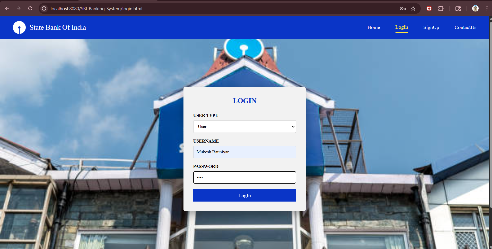
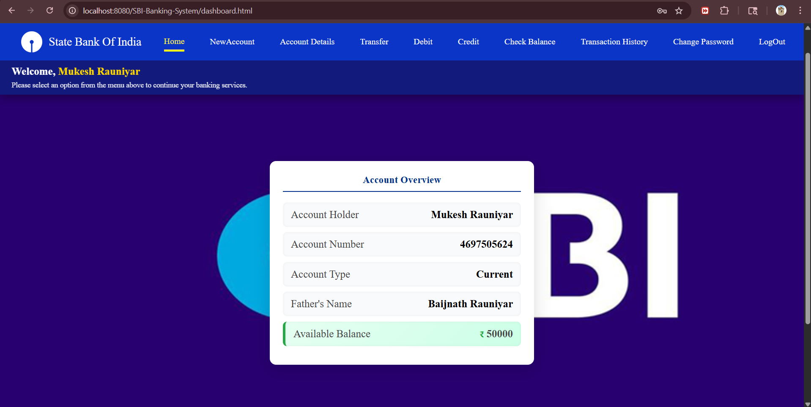
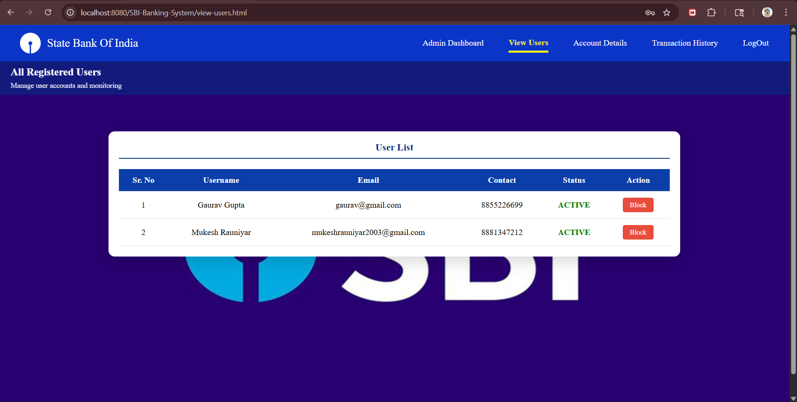

# 🏦 SBI Banking System

A full-stack web-based banking application developed using **Java Servlets, JSP, MySQL, and Apache Tomcat**.  
This project simulates real-world banking operations like account management, transactions, and authentication.

---

## 📌 Overview

The **SBI Banking System** is designed as a real-world banking prototype using **MVC architecture**.  
It allows users to perform secure banking operations such as account creation, money transfer, and transaction tracking.

---

## 🚀 Tech Stack

- 💻 Frontend: HTML, CSS, JavaScript
- ⚙️ Backend: Java Servlets (Jakarta EE)
- 🗄️ Database: MySQL
- 🌐 Server: Apache Tomcat
- 🧩 Architecture: MVC (Model-View-Controller)

---

## 🔐 Key Features

### 👤 User Features
- User Registration & Login
- Create Bank Account
- Check Balance
- Deposit Money
- Withdraw Money
- Fund Transfer
- Transaction History
- Session Management

### 🛠️ Admin Features
- View All Users
- Monitor Accounts
- Block / Unblock Users

---

## 🏗️ Project Architecture

src/
└── main/
├── java/
│ └── controllers/ (Servlets)
└── webapp/
├── html files
├── css/
├── js/
└── images/


### Layers:

- **Presentation Layer** → HTML, CSS, JS
- **Controller Layer** → Servlets
- **Business Logic** → Java Classes
- **Database Layer** → MySQL (JDBC)

---

## 🗄️ Database Design

- `users` → user credentials
- `accounts` → account details
- `transactions` → transaction records

---

## ⚙️ Setup Instructions (Run Locally)

### 1️⃣ Clone Repository

```bash
- git clone https://github.com/YOUR_USERNAME/sbi-banking-system.git

### 2️⃣ Import Project
Open Eclipse / IntelliJ
Import as Dynamic Web Project

3️⃣ Configure Database
Create MySQL database:

- CREATE DATABASE sbi_bank;

### Update credentials in DBConnection.java:

String url = "jdbc:mysql://localhost:3306/sbi_bank";
String user = "your_username";
String password = "your_password";

### 4️⃣ Run on Server
Add project to Apache Tomcat 10
Start server

### 🌐 Access Application
http://localhost:8080/SBI-Banking-System/

## 📸 Screenshots

### 🔹 Landing Page


### 🔹 User Login


### 🔹 User Dashboard


### 🔹 View Users



🎯 Learning Outcomes
- Java Servlet Lifecycle
- JDBC with MySQL
- Session Management
- MVC Architecture
- Web Deployment using Tomcat

🔒 Security Note
⚠️ Important:
Database credentials are not included for security reasons.
Configure your own credentials before running.

📌 Future Enhancements
- Admin Dashboard Improvements
- Email Notifications
- OTP Authentication
- REST API Integration
- Spring Boot Migration
- JWT Authentication


👨‍💻 Author

Mukesh Rauniyar
Java Full Stack Developer


⭐ Support

If you like this project:
👉 Star this repository
👉 Share with others
👉 Fork and improve
